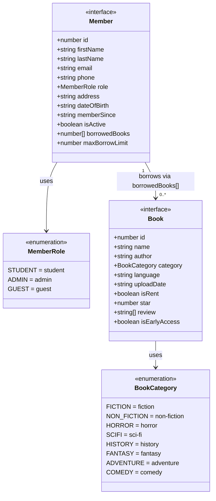
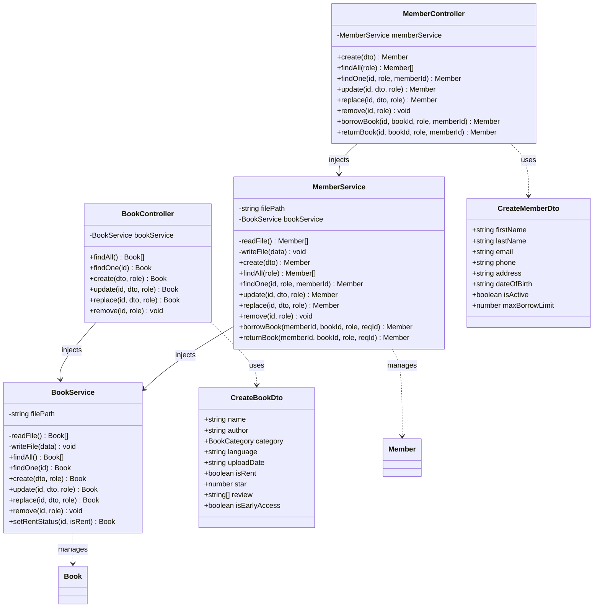
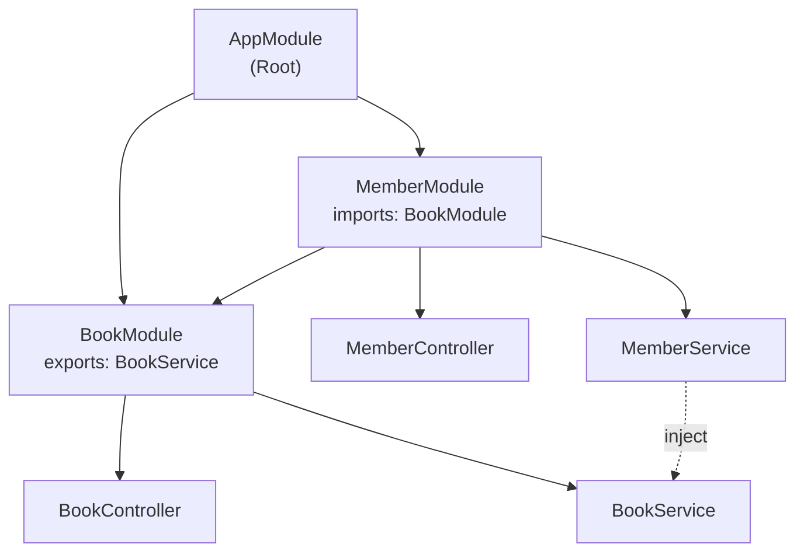
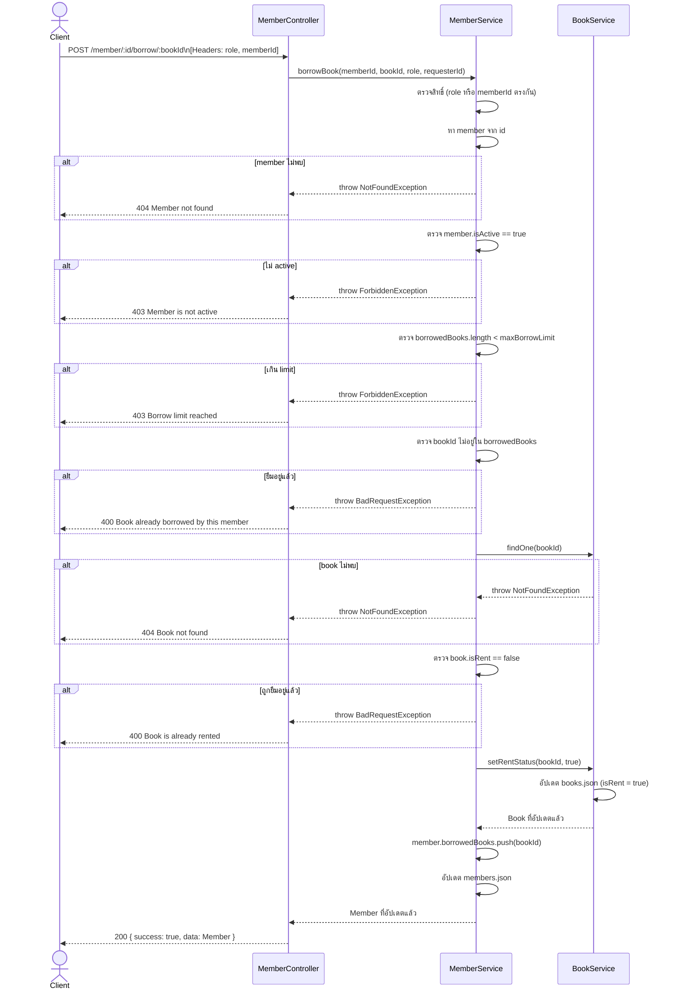
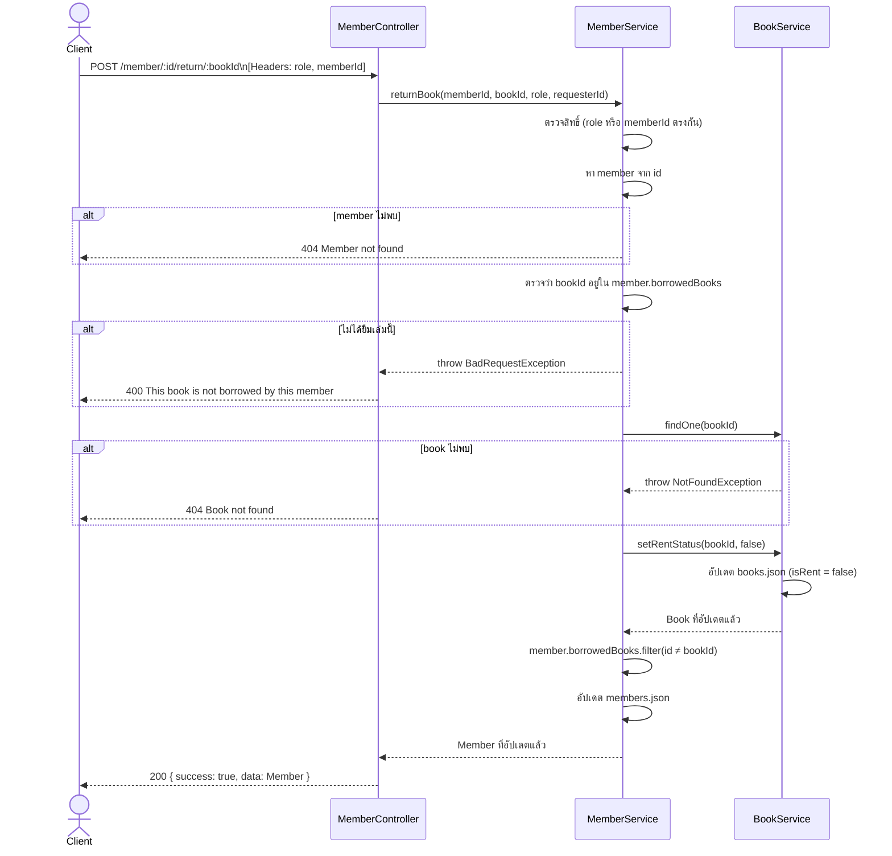

# UML Diagram — Library Management System

---

## 1. Class Diagram — Data Models

แสดงโครงสร้างข้อมูลหลักและความสัมพันธ์

---

## 2. Class Diagram — Architecture (Controllers & Services)

แสดงโครงสร้าง NestJS modules, controllers, และ services

---

## 3. Module Dependency Diagram

แสดงความสัมพันธ์ระหว่าง NestJS Modules

---

## 4. Sequence Diagram — ยืมหนังสือ (Borrow)

แสดงขั้นตอนการทำงานเมื่อ member ยืมหนังสือ

---

## 5. Sequence Diagram — คืนหนังสือ (Return)

แสดงขั้นตอนการทำงานเมื่อ member คืนหนังสือ

