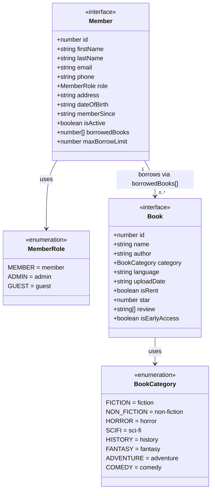
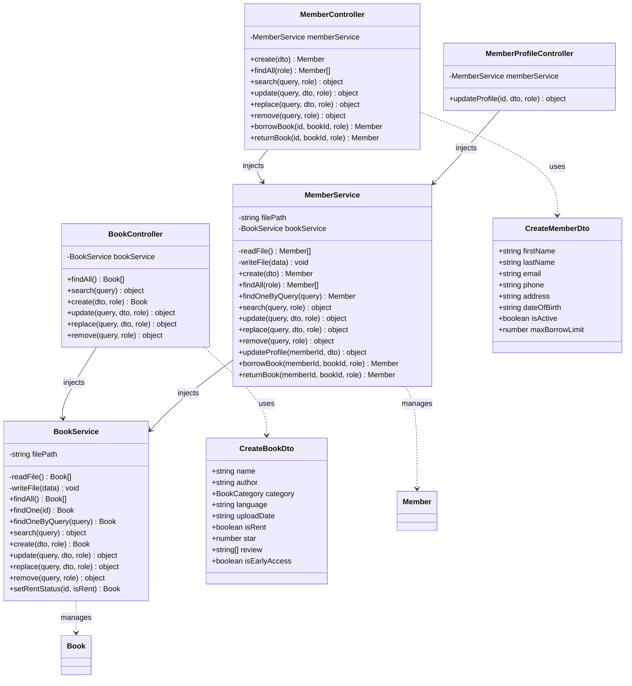

# UML Diagram — Library Management System

---

## 1. Class Diagram — Data Models

แสดงโครงสร้างข้อมูลหลักและความสัมพันธ์

```mermaid
classDiagram
    class BookCategory {
        <<enumeration>>
        FICTION = fiction
        NON_FICTION = non-fiction
        HORROR = horror
        SCIFI = sci-fi
        HISTORY = history
        FANTASY = fantasy
        ADVENTURE = adventure
        COMEDY = comedy
    }

    class MemberRole {
        <<enumeration>>
        MEMBER = member
        ADMIN = admin
        GUEST = guest
    }

    class Book {
        <<interface>>
        +number id
        +string name
        +string author
        +BookCategory category
        +string language
        +string uploadDate
        +boolean isRent
        +number star
        +string[] review
        +boolean isEarlyAccess
    }

    class Member {
        <<interface>>
        +number id
        +string firstName
        +string lastName
        +string email
        +string phone
        +MemberRole role
        +string address
        +string dateOfBirth
        +string memberSince
        +boolean isActive
        +number[] borrowedBooks
        +number maxBorrowLimit
    }

    Book --> BookCategory : uses
    Member --> MemberRole : uses
    Member "1" --> "0..*" Book : borrows via borrowedBooks[]
```

---

## 2. Class Diagram — Architecture (Controllers & Services)

แสดงโครงสร้าง NestJS modules, controllers, และ services

```mermaid
classDiagram
    class BookController {
        -BookService bookService
        +findAll() Book[]
        +search(query) object
        +create(dto, role) Book
        +update(query, dto, role) object
        +replace(query, dto, role) object
        +remove(query, role) object
    }

    class BookService {
        -string filePath
        -readFile() Book[]
        -writeFile(data) void
        +findAll() Book[]
        +findOne(id) Book
        +findOneByQuery(query) Book
        +search(query) object
        +create(dto, role) Book
        +update(query, dto, role) object
        +replace(query, dto, role) object
        +remove(query, role) object
        +setRentStatus(id, isRent) Book
    }

    class MemberController {
        -MemberService memberService
        +create(dto) Member
        +findAll(role) Member[]
        +search(query, role) object
        +update(query, dto, role) object
        +replace(query, dto, role) object
        +remove(query, role) object
        +borrowBook(id, bookId, role) Member
        +returnBook(id, bookId, role) Member
    }

    class MemberProfileController {
        -MemberService memberService
        +updateProfile(id, dto, role) object
    }

    class MemberService {
        -string filePath
        -BookService bookService
        -readFile() Member[]
        -writeFile(data) void
        +create(dto) Member
        +findAll(role) Member[]
        +findOneByQuery(query) Member
        +search(query, role) object
        +update(query, dto, role) object
        +replace(query, dto, role) object
        +remove(query, role) object
        +updateProfile(memberId, dto) object
        +borrowBook(memberId, bookId, role) Member
        +returnBook(memberId, bookId, role) Member
    }

    class CreateBookDto {
        +string name
        +string author
        +BookCategory category
        +string language
        +string uploadDate
        +boolean isRent
        +number star
        +string[] review
        +boolean isEarlyAccess
    }

    class CreateMemberDto {
        +string firstName
        +string lastName
        +string email
        +string phone
        +string address
        +string dateOfBirth
        +boolean isActive
        +number maxBorrowLimit
    }

    BookController --> BookService : injects
    MemberController --> MemberService : injects
    MemberProfileController --> MemberService : injects
    MemberService --> BookService : injects
    BookController ..> CreateBookDto : uses
    MemberController ..> CreateMemberDto : uses
    BookService ..> Book : manages
    MemberService ..> Member : manages
```

---

